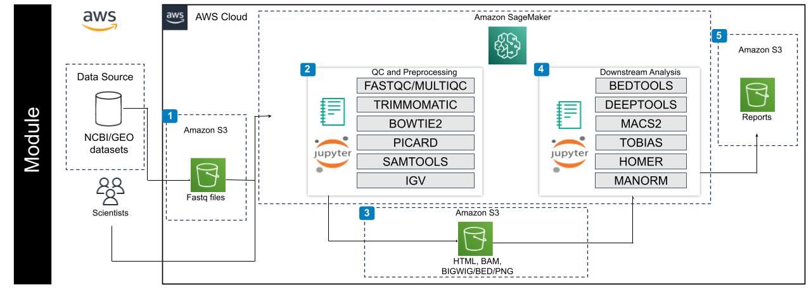

## Contents

+ [Getting Started](#getting-started)
+ [Architecture Diagrams](#architecture-diagrams)

## Getting Started

This repository contains several notebook files which serve as bioinformatics workflow tutorials.

The following steps guide you through setting up a notebook instance on Amazon Web Services (AWS), downloading our tutorial files, and running those files.

Accordingly, before starting, ensure you have an AWS account.

Once you have these, begin by navigating to the AWS Management Console at https://console.aws.amazon.com/ and logging in with your credentials.  In the top-right corner of the screen, verify that you've selected the correct AWS Region. This region is important as your resources will be created within it. You can choose the region from the dropdown menu.

### Creating a notebook instance in Amazon SageMaker AI 

Follow the steps highlighted [here](https://github.com/NIGMS/NIGMS-Sandbox/blob/main/docs/HowToCreateAWSSagemakerNotebooks.md) to create a new notebook instance in Amazon SageMaker. Follow steps and be especially careful to enable idle shutdown as highlighted. 

#### **Notebook Creation for submodules 1-3:**

For these submodules, in step 4 in the "Notebook instance type" tab, select `ml.m5.xlarge` from the dropdown box, and increase the volume size to 100 GB. Select conda_python3 kernel in step 8.

#### **Notebook Creation for submodule 4:**
  
To run this submodule, an Nvidia GPU is required. In step 4 of the "Notebook instance type" tab, select `ml.g4dn.2xlarge` from the dropdown menu, as it has an NVIDIA T4 GPU, and increase the volume size to 100 GB.

Note, when you are finished running code, you should turn off your virtual machine to prevent unneeded billing or resource use by checking your notebook and pushing the **Stop** button. 

### Downloading Tutorial Files

 You will need to download the tutorial files from GitHub. The easiest way to do this would be to clone the repository from NIGMS into your Amazon SageMaker notebook. To clone this repository, use the Git symbole on left menu and then insert the link `https://github.com/NIGMS/ATAC-Seq-and-Single-Cell-ATAC-Seq-Analysis.git` as it is illustrated below. There are other bioinformatics related learning modules available in the [NIGMS Repository](https://github.com/NIGMS).

This should download our repository, and the tutorial files inside, into a folder called 'ATAC-Seq-and-Single-Cell-ATAC-Seq-Analysis'. Double-click this folder now. Inside you will find all our tutorial files, which you can double-click and run.


### Running Tutorial Files

All our tutorial workflows are in Jupyter Notebook format. To run them you need only to double-click the tutorial file you want.

This will open the Jupyter file in Jupyter Notebook. From here you can run each section, or 'cell', of the code, one by one, by pushing the 'Play' button on the above menu. 

Some 'cells' of code take longer for the computer to process than others. You will know a cell is running when a cell has an asterisk next to it \[\*\]. Wait until the \[\*\] disappears before you run the next code block. When the cell finishes running, that asterisk will be replaced with a number which represents the order that cell was run in.

You can now explore the tutorials by running the code in each, from top to bottom. Look at the 'workflows' section below for a short description of each tutorial.

Jupyter is a powerful tool, with many useful features. For more information on how to use Jupyter, we recommend searching for Jupyter tutorials and literature online.

### Configuration for Submodule 4: Single-Cell Genomics Analysis with RAPIDS

Unified Virtual Memory (UVM) can be used to [oversubscribe](https://developer.nvidia.com/blog/beyond-gpu-memory-limits-unified-memory-pascal/) your GPU memory so that chunks of data will be automatically offloaded to main memory when necessary. This is a great way to explore data without having to worry about out of memory errors, but it does degrade performance in proportion to the amount of oversubscription. UVM is enabled by default in these examples and can be enabled/disabled in any RAPIDS workflow with the following:

```
import cupy as cp
import rmm
rmm.reinitialize(managed_memory=True)
```

## Architecture Diagrams

The below diagrams reflect the cloud services utilized to deploy our workflows on the Amazon Web Services using SageMaker AI and Jupyter Notebooks. 



## AWS Bedrock (Optional)

Generative AI is available for this tutorial if you would like to use it. To run it, please reference Tutorial 1, or run the following code within a submodule notebook.

```!pip install -q ipywidgets
import sys
import os
util_path = os.path.join(os.getcwd(), 'util')
if util_path not in sys.path:
    sys.path.append(util_path)

# Import the display_widgets function from your Python file
from genai import display_widgets

# Call the function to display the widgets
display_widgets()