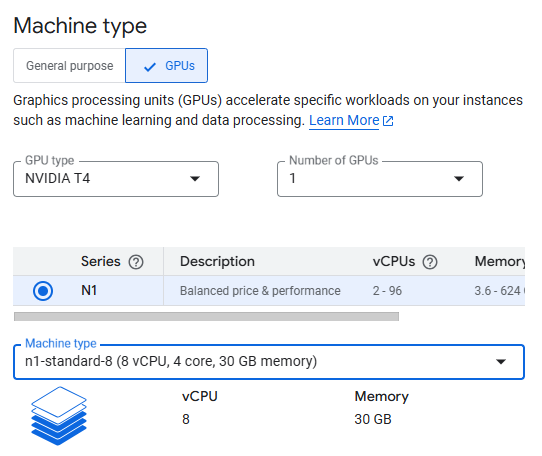
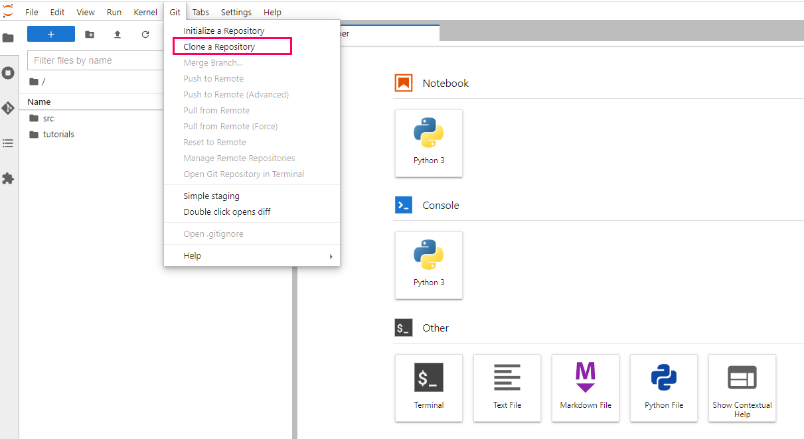

## Contents


+ [Getting Started](#getting-started)
+ [Architecture Diagrams](#architecture-diagrams)

## Getting Started

This repository contains several notebook files which serve as bioinformatics workflow tutorials.

The below steps guide you through setting up a notebook instance on Google Cloud Platform, downloading our tutorial files, and running those files. 

Accordingly, before starting, make sure you have a Google account and have access to a Google Cloud Platform project.

Once you have these, you can begin by first navigating to https://console.cloud.google.com/ and logging in with your credentials. Then, in the top-left of the screen, navigate to 'select a project', and choose the project you belong to.

### Creating a notebook instance in Vertex AI Workbench

Follow the steps highlighted [here](https://github.com/NIGMS/NIGMS-Sandbox/blob/main/docs/HowToCreateVertexAINotebooks.md) to create a new notebook instance in Vertex AI. Follow steps 1-8 and be especially careful to enable idle shutdown as highlighted in step 8.

#### **Notebook Creation for submodules 1-3:**

Notebooks for submodules 1-3 use a GCP provided 'Python3' image. A default machine `n1-standard-4` has 4 vCPUS and 15GB RAM which is sufficient for submodules 1-3 using the example dataset. Creating a machine may take a few minutes to finish.

#### **Notebook Creation for submodule 4:**
  
For this notebook to run we need an Nvidia GPU. For "Machine Type" use `n1-standard-8`, and attach an NVIDIA T4 GPU.
  


Note, when you are finished running code, you should turn off your virtual machine to prevent unneeded billing or resource use by checking your notebook and pushing the **Stop** button. 

### Downloading Tutorial Files

To clone this repository, use the Git command `git clone https://github.com/NIGMS/ATAC-Seq-and-Single-Cell-ATAC-Seq-Analysis.git` in the dropdown menu option in Jupyter notebook. Please make sure you only enter the link for the repository that you want to clone. There are other bioinformatics related learning modules available in the [NIGMS Repository](https://github.com/NIGMS).

This should download our repository, and the tutorial files inside, into a folder called 'ATAC-Seq-and-Single-Cell-ATAC-Seq-Analysis'. Double-click this folder now. Inside you will find all our tutorial files, which you can double-click and run.



### Running Tutorial Files

All our tutorial workflows are in Jupyter Notebook format. To run them you need only to double-click the tutorial file you want.

This will open the Jupyter file in Jupyter Notebook. From here you can run each section, or 'cell', of the code, one by one, by pushing the 'Play' button on the above menu. 

Some 'cells' of code take longer for the computer to process than others. You will know a cell is running when a cell has an asterisk next to it \[\*\]. Wait until the \[\*\] disappears before you run the next code block. When the cell finishes running, that asterisk will be replaced with a number which represents the order that cell was run in.

You can now explore the tutorials by running the code in each, from top to bottom. Look at the 'workflows' section below for a short description of each tutorial.

Jupyter is a powerful tool, with many useful features. For more information on how to use Jupyter, we recommend searching for Jupyter tutorials and literature online.

### Configuration for Submodule 4: Single-Cell Genomics Analysis with RAPIDS

Unified Virtual Memory (UVM) can be used to [oversubscribe](https://developer.nvidia.com/blog/beyond-gpu-memory-limits-unified-memory-pascal/) your GPU memory so that chunks of data will be automatically offloaded to main memory when necessary. This is a great way to explore data without having to worry about out of memory errors, but it does degrade performance in proportion to the amount of oversubscription. UVM is enabled by default in these examples and can be enabled/disabled in any RAPIDS workflow with the following:

```
import cupy as cp
import rmm
rmm.reinitialize(managed_memory=True)
```

## Architecture Diagrams

The below diagrams reflect the cloud services utilized to deploy our workflows on the Google Cloud Platform using VertexAI and Jupyter Notebooks. 

