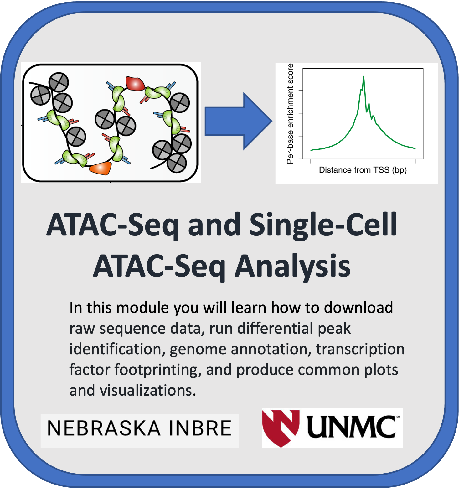
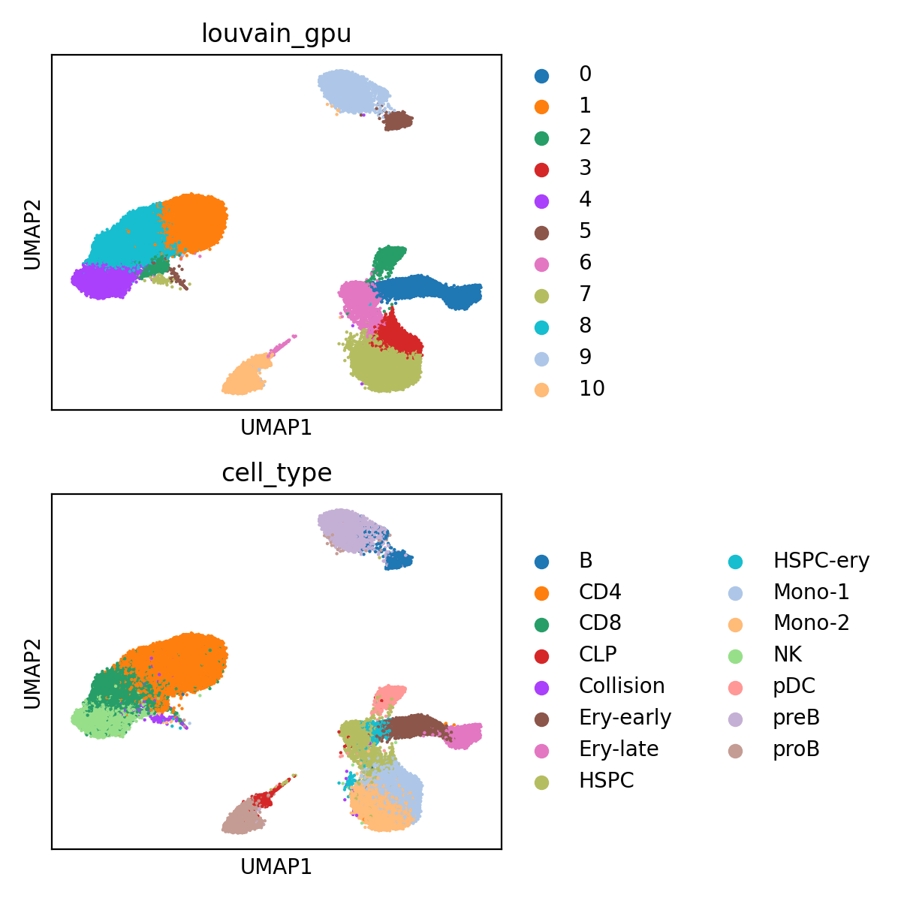
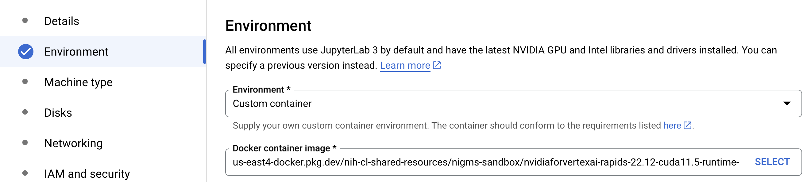
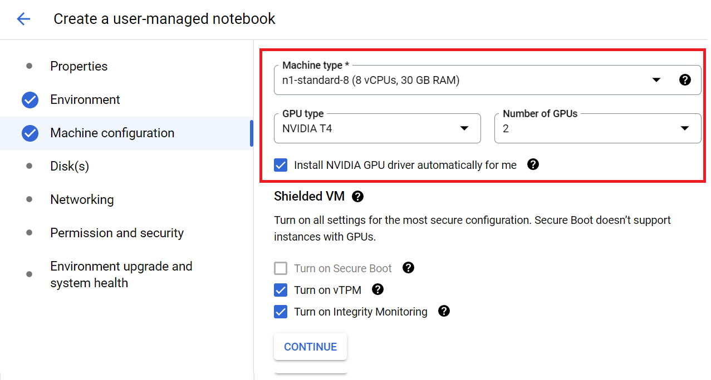
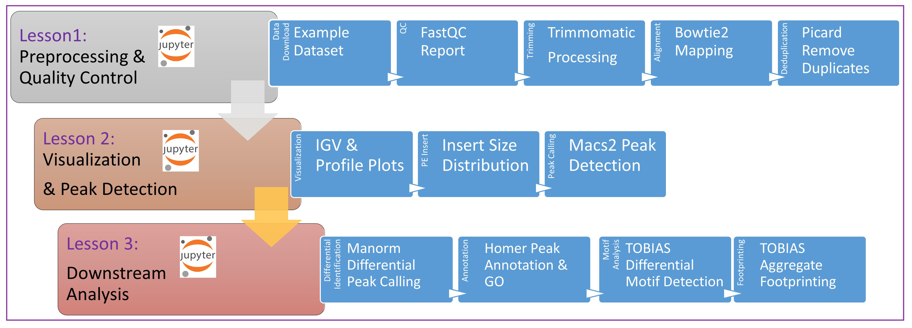
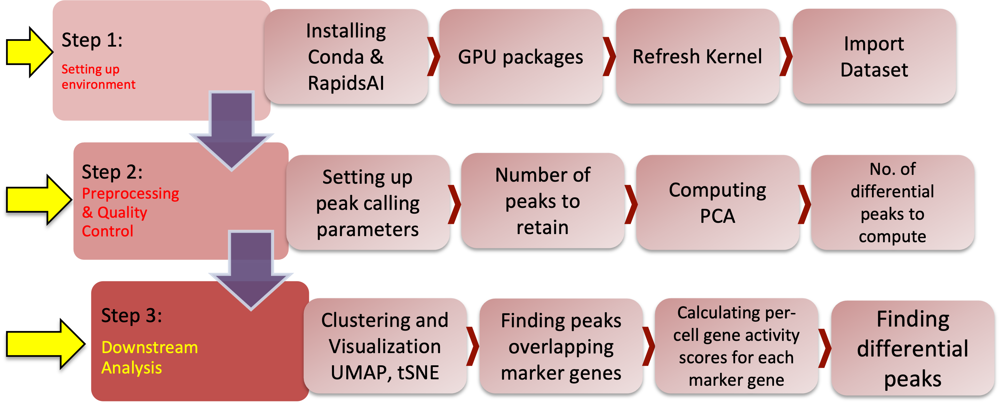
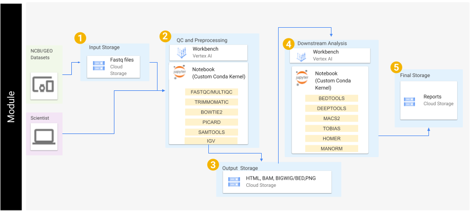

[comment]: <> (Hi. If you are seeing this message, please open this file with markdown preview or Jupyter Notebook. You can do this by right clicking on the readme file and picking 'open with'.)

Image adapted from https://doi.org/10.1038/s41596-022-00692-9   
   
   
# An open-source interactive pipeline tutorial for differential ATAC-seq footprint analysis
## INBRE Google Cloud Training Tutorials - ATAC-seq


## Overview

Included here are several tutorials in the form of Jupyter Notebooks.

The purpose of these tutorials is to help users familiarize themselves with the analysis steps for processing ATAC-seq data including considerations for single-end, paired-end, or single-cell data. 



These tutorials do this by going step-by-step through specific workflows. These workflows cover the start to finish of basic bioinformatics analysis; starting from downloading raw sequence data, and extending to differential peak identification, genome annotation, and transcription factor footprinting, while producing common plots and visualizations. Submodules 1 through 3 focus on analysis of bulk cellular data while submodule 4 focuses on single cell data. 

For submodule 4, we will use RAPIDS pipeline to demonstrate on how to use analyze single-cell ATAC sequencing data. We demonstrate the use of RAPIDS pipeline to accelerate the analysis of single-cell ATAC-seq data from 60,495 cells.  RAPIDS is a suite of open-source Python libraries that can speed up data science workflows. We start with the peak-cell matrix, then perform peak selection, normalization, dimensionality reduction, clustering, and visualization. We also visualize regulatory activity at marker genes and compute differential peaks.

Dataset sizes for single-cell genomics studies are increasing, presently reaching millions of cells. With RAPIDS pipeline, it becomes easy to analyze large datasets interactively and in real time, enabling faster scientific discoveries.

This module will cost you about $3.80 to run, assuming you tear down all resources upon its completion.

Watch this [Introduction Video](https://youtu.be/w5reYUKnf60) to learn more about the module.  

## Table of Contents

+ [Requirements](#requirements)
+ [Getting Started](#getting-started)
+ [Workflows](#workflows)
+ [Data](#data)
+ [Funding](#funding)


## Requirements

These tutorials were designed to be used on cloud computing platforms, with the aim of requiring nothing but the files within this GitHub repository.

With this in mind, our tutorials use Jupyter Notebook files, which Google Cloud Platform, Amazon Web Services, and Microsoft Azure all provide support for. Therefore, requirements should only require creation of a virtual machine on one of these providers, and the downloading of this repositories files to the machine. It is important to note that submodule 4 uses a custom image created with Docker which has pre-requisite NVIDIA software and drivers installed for single cell analysis. GCP uses port 8080 for jupyterlab which allows this image to be opened in VertexAI. You'll see this reflected in the Dockerfile that is included in the Tutorial 4 directory. Steps to make the Dockerfile in GCP are included below and can be done from any VM or cloud shell. To reuse, `keen-clarity-352623` must be replaced with your own GCP project id and container registry or artifact registry must be active with the gcr.io repo inside.

```
docker build ./
docker tag 2c44b046c59c gcr.io/keen-clarity-352623/nvidiaforvertexai-rapids-22.12-cuda11.5-runtime-ubuntu20.04-py3.9
docker push gcr.io/keen-clarity-352623/nvidiaforvertexai-rapids-22.12-cuda11.5-runtime-ubuntu20.04-py3.9
```


For more information on creating a virtual machine and downloading our git repository to that machine, see the getting started section below. Currently this section only includes information on how to do this using Google Cloud Platform.


## Getting Started

This repository contains several notebook files which serve as bioinformatics workflow tutorials.

The below steps guide you through setting up a virtual machine on Google Cloud Platform, downloading our tutorial files, and running those files. 

Accordingly, before starting, make sure you have a Google account and have access to a Google Cloud Platform project.

Once you have these, you can begin by first navigating to https://console.cloud.google.com/ and logging in with your credentials. Then, in the top-left of the screen, navigate to 'select a project', and choose the project you belong to.

### Navigating to the Vertex AI Workbench

### Creating a user managed notebook

Follow the steps highlighted [here](https://github.com/STRIDES/NIHCloudLabGCP/blob/main/docs/vertexai.md) to create a new user-managed notebook in Vertex AI. Follow steps 1-8 and be especially careful to enable idle shutdown as highlighted in step 7.

**Notebook Creation for submodules 1-3:**

Notebooks for submodules 1-3 use a GCP provided 'Python3' image. You can then choose a name for your virtual machine, you can name it whatever you like. A default machine (n1-standard-4) has 4 vCPUS and 15GB RAM which is sufficient for submodules 1-3 using the example dataset. Creating a machine may take a few minutes to finish.

**Notebook Creation for submodule 4:**

The notebook for submodule 4 uses a custom image, which means it needs to run in a separate VM from submodules 1-3. To configure this, you should select Debian 10 and Custom container in the Environment tab in step 5. In the Docker containter image field enter the following path `us-east4-docker.pkg.dev/nih-cl-shared-resources/nigms-sandbox/nvidiaforvertexai-rapids-22.12-cuda11.5-runtime-ubuntu20.04-py3.9@sha256:bb6703315633f21281e8caceed811f74822564a63ede01953664fe8d58b0c658` 

In step 6 in the Machine type tab, select n1-standard-8 from the dropdown box.
  

  
Finally, in Machine Type use the following parameters to set up your machine. Make sure to select install NVIDIA Drivers. You can continue and create your machine. 
  


Note, when you are finished running code, you should turn off your virtual machine to prevent unneeded billing or resource use by checking your notebook and pushing the **Stop** button. 

### Downloading Tutorial Files

To clone this repository, use the Git command `git clone https://github.com/NIGMS/ATAC-Seq-and-Single-Cell-ATAC-Seq-Analysis.git` in the dropdown menu option in Jupyter notebook. Please make sure you only enter the link for the repository that you want to clone. There are other bioinformatics related learning modules available in the [NIGMS Repository](https://github.com/NIGMS).

This should download our repository, and the tutorial files inside, into a folder called 'ATAC-Seq-and-Single-Cell-ATAC-Seq-Analysis'. Double-click this folder now. Inside you will find all our tutorial files, which you can double-click and run.


### Running Tutorial Files

All our tutorial workflows are in Jupyter Notebook format. To run them you need only to double-click the tutorial file you want.

This will open the Jupyter file in Jupyter Notebook. From here you can run each section, or 'cell', of the code, one by one, by pushing the 'Play' button on the above menu. 

Some 'cells' of code take longer for the computer to process than others. You will know a cell is running when a cell has an asterisk next to it \[\*\]. Wait until the \[\*\] disappears before you run the next code block. When the cell finishes running, that asterisk will be replaced with a number which represents the order that cell was run in.

You can now explore the tutorials by running the code in each, from top to bottom. Look at the 'workflows' section below for a short description of each tutorial.

Jupyter is a powerful tool, with many useful features. For more information on how to use Jupyter, we recommend searching for Jupyter tutorials and literature online.

### Configuration for Submodule 4: Single-Cell Genomics Analysis with RAPIDS
#### conda 
All dependencies for these examples can be installed with conda.

After installing the necessary dependencies, you can just run `jupyter lab notebook`.

#### RAPIDS

Unified Virtual Memory (UVM) can be used to [oversubscribe](https://developer.nvidia.com/blog/beyond-gpu-memory-limits-unified-memory-pascal/) your GPU memory so that chunks of data will be automatically offloaded to main memory when necessary. This is a great way to explore data without having to worry about out of memory errors, but it does degrade performance in proportion to the amount of oversubscription. UVM is enabled by default in these examples and can be enabled/disabled in any RAPIDS workflow with the following:


```
import cupy as cp
import rmm
rmm.reinitialize(managed_memory=True)
cp.cuda.set_allocator(rmm.rmm_cupy_allocator)
```

### Stopping Your Virtual Machine

When you are finished running code, you can turn off your virtual machine to prevent unneeded billing or resource use by checking your notebook and pushing the 'Stop' button.

## Workflows

Our tutorials are broken down into 'workflows'. These can be downloaded and run locally, or you can use cloud services outlined in this README file. For example, these notebooks have been tested in Google Cloud using the Vertex AI Workbench to run Jupyter Notebooks.

Each notebook file covers a specific workflow, which contains written and visual commentary, as well as the actual step-by-step code for running that workflow analysis. 

For more information on how to run these in the cloud, navigate to the [Getting Started](#getting-started) section. Feel free to explore ad use these workflows however works best for you. Each one builds from the previous tutorial, but they also can stand alone if you already know the concepts in the early ones. 



**Workflow for ATAC Sequencing (submodules 1 through 3)**


**[Tutorial One](ATACseq_Tutorial1_Preprocessing.ipynb):** This short tutorial demonstrates the initial processing steps for ATAC-seq analysis. In this module we focus on generating quality reports of the fastq files, adapter trimming, mapping, and removal of PCR duplicates.

**[Tutorial Two](ATACseq_Tutorial2_PeakDetection.ipynb):** In this section we will focus on visualization of the signal, create average plots of signal around transcription start sites (TSSs), and identification of peak signal.

**[Tutorial Three](ATACseq_Tutorial3_Downstream.ipynb):** In this section we will focus on differential peak identification, motif footprinting, and annotation of nearby genomic features.


**Workflow for sc-ATAC Sequencing (submodule 4)**. 
  

**[Tutorial Four](scATACseq_Tutorial4.ipynb):** In this section we will demonstrate a single cell ATAC-Seq analysis workflow. 

## GCP Architecture Diagrams

The below diagrams reflect the cloud services utilized to deploy our workflows on the Google Cloud Platform using VertexAI and Jupyter Notebooks. 




## Data

In the ATAC Sequencing tutorial(notebooks 1 through 3) we will process a randomly chosen published dataset. This is available from GEO: GSE67382 Bao X, Rubin AJ, Qu K, Zhang J et al. A novel ATAC-seq approach reveals lineage-specific reinforcement of the open chromatin landscape via cooperation between BAF and p63. Genome Biol 2015 Dec 18;16:284. PMID: [26683334](https://pubmed.ncbi.nlm.nih.gov/26683334/)

This dataset is paired-end 50 bp sequencing. We will analyze two samples representing NHEK cells with BAF depletion compared to a control. Note that to allow faster processing we have limited the reads to that of a specific region of chromosome 4.

The 4th notebook focusing on single cell analysis will use data from Lareau et al., Nat Biotech 2019, one of the highest throughput single-cell ATAC-seq experiments to date. In this tutorial we focus on the 60K resting cells from this experiment. PMID: [33637727](https://pubmed.ncbi.nlm.nih.gov/33637727/)

## Funding

Funded by the INBRE Program (NIH/NIGMS P20 GM103427).

## **License for Data**

Text and materials are licensed under a Creative Commons CC-BY-NC-SA license. The license allows you to copy, remix and redistribute any of our publicly available materials, under the condition that you attribute the work (details in the license) and do not make profits from it. More information is available [here](https://tilburgsciencehub.com/about/#license).


This work is licensed under a [Creative Commons Attribution-NonCommercial-ShareAlike 4.0 International License](http://creativecommons.org/licenses/by-nc-sa/4.0/)
